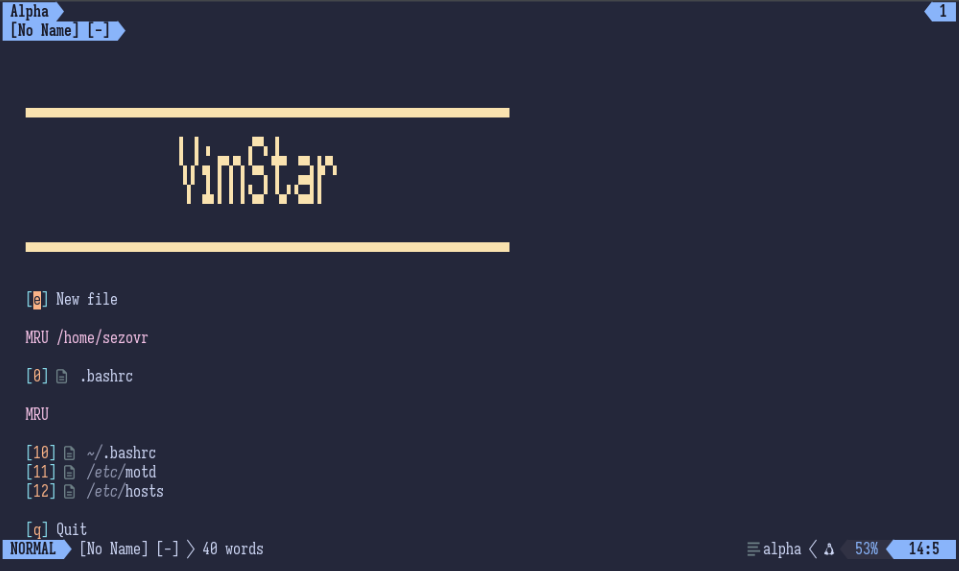
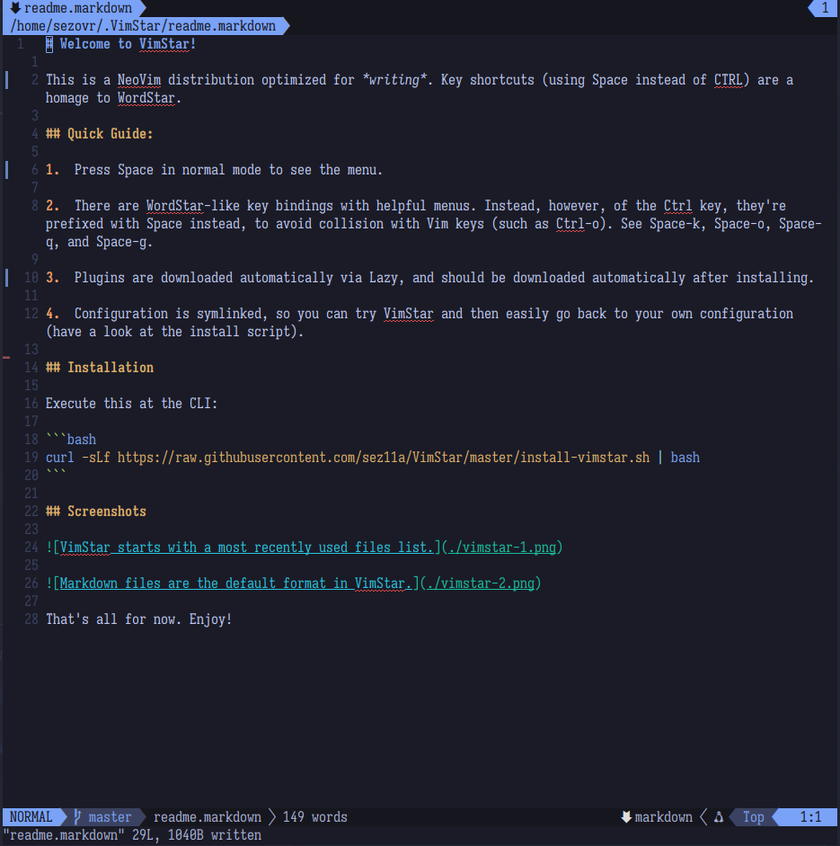

  <p>VimStar turns Neovim into a word processor while retaining Neovim's powerful completion, debugging, and navigation for all your coding needs. With a menu system inspired by WordStar, it's ideal for technical writing, creative writing, coding, and even publishing.</p>

<div class="features">
  <div class="feature-card">
    <h3>📝 Writing First</h3>
    <p>Supports Markdown, LaTeX, and Typst, displays word count, publishes with Pandoc.</p>
  </div>
  <div class="feature-card">
    <h3>⚡ WordStar Menus</h3>
    <p>Space-K (Block & Save), Space-O (Onscreen Format), Space-P (Print Controls), Space-Q (Quick Menu) organize word processing functions.</p>
  </div>
  <div class="feature-card">
    <h3>🤖 AI Assistant</h3>
    <p>Integrates <a href="https://github.com/olimorris/codecompanion.nvim">CodeCompanion</a> with <a href="https://ollama.com">Ollama</a> for inline suggestions and chat</p>
  </div>
  <div class="feature-card">
    <h3>💻 Language Support</h3>
    <p>LSPs for Lua, TypeScript, Python, Java, C; debugging for Python, Go, Java</p>
  </div>
  <div class="feature-card">
    <h3>📚 Wiki System</h3>
    <p>Complete time management system implemented with <a href="https://github.com/lervag/wiki.vim">wiki.vim</a> and Markdown.</p>
  </div>
  <div class="feature-card">
    <h3>🛠️ Auto-Installed</h3>
    <p><a href="https://github.com/folke/lazy.nvim">Lazy.vim</a> manages plugins, Mason manages LSPs, Tree-sitter manages syntax.</p>
  </div>
</div>

<h2>Screenshots</h2>

<div class="screenshots">
  <div class="screenshot">
    <h3>Dashboard</h3>
    <p>The ASCII art dashboard shows recently opened files.</p>
    
  </div>
  <div class="screenshot">
    <h3>Markdown Editing</h3>
    <p>Markdown is the default filetype with spell check enabled.</p>
    
  </div>
</div>

## Install

The installation script clones or updates VimStar to the active user's home directory and links that to Neovim's config directory:
- Linux: `~/.config/nvim`
- macOS: `~/Library/Application Support/nvim`
- Windows: `$env:LOCALAPPDATA\nvim`

If you have a Neovim configuration already, rename the config directory or back it up and remove it before installing. 

### Requirements 

- [Neovim](https://neovim.io) 0.9+ 
- [Git](https://git-scm.com/) (must be available in PATH)
- [Pandoc](https://pandoc.org) for publishing/conversions
- [Ollama](https://ollama.com) for AI chat/completion features
- [Yarn](https://yarnpkg.com/) to compile Markdown preview

### Linux/macOS

```bash
curl -sLf https://raw.githubusercontent.com/sez11a/VimStar/master/install-vimstar.sh | bash
```

### Windows

Open PowerShell and run

```powershell
Set-ExecutionPolicy Bypass -Scope Process -Force
irm https://raw.githubusercontent.com/sez11a/VimStar/master/install-vimstar.ps1 | iex
```

**Note:** The Windows script was generated by AI and has not been tested. Report any issues in the GitHub repository.

### Manual Installation

You should read the scripts above before running them. If you don't want to or you want to install manually, here's how: 

**Clone the Repository**

```bash
git clone https://github.com/sez11a/VimStar ~/.VimStar
```

**Create symlink (Linux)**

```bash
ln -sfn ~/.VimStar ~/.config/nvim
```

**Create symlink (macOS)**
```bash
ln -sfn ~/.VimStar ~/Library/Application\ Support/nvim
```

**Create symlink (Windows PowerShell)**
```powershell
New-Item -ItemType SymbolicLink -Path $env:LOCALAPPDATA\nvim -Target ~/.VimStar -Force
```

### First Launch

1. Run `nvim`.
2. Wait for Lazy.nvim to install plugins.
3. Quit and restart `nvim`. It is now VimStar! 

### Troubleshooting

- **Plugins not installing**: Run `Space-ql` to open Lazy.nvim and check for errors
- **Treesitter highlighting broken**: Run `Space-qt` to update parsers
- **Spell check not working**: Ensure `~/.VimStar/spell/` directory exists

<h2>License</h2>

<p>MIT License - see <a href="/license">LICENSE</a> for details.</p>